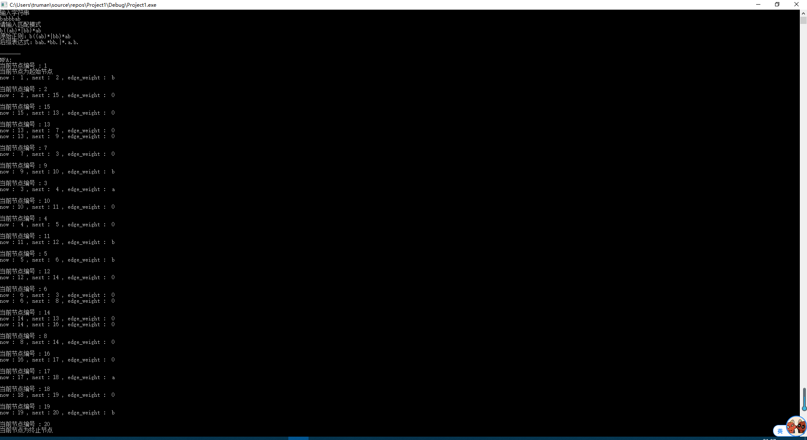
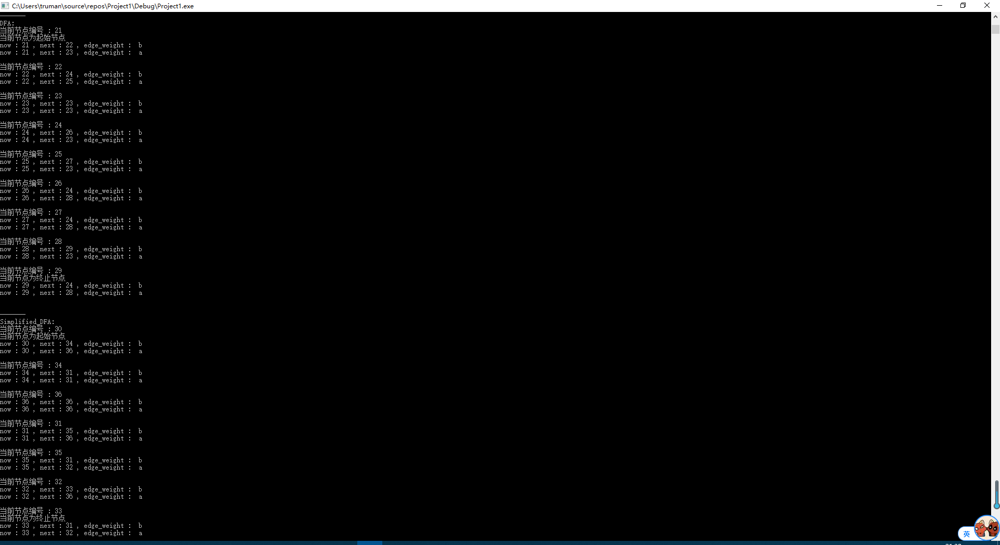
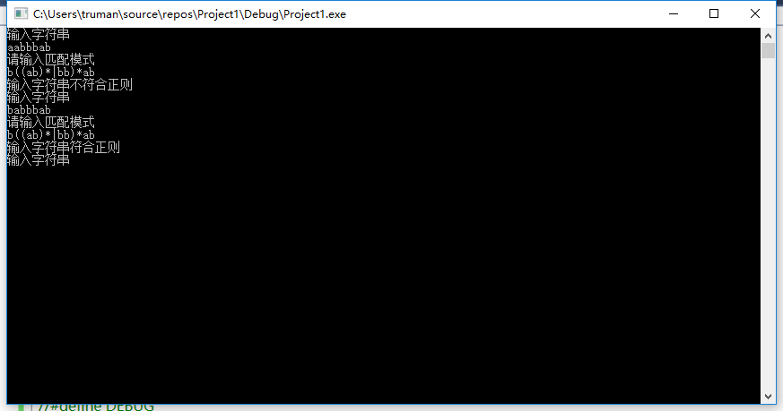

# 简单正则的匹配

## 任务目标/流程
- [x] 添加连接符
- [x] 转后缀表达式
- [x] 生成NFA
- [x] NFA转DFA
- [x] DFA最小化
- [x] 利用DFA进行匹配检查

## 部分 函数/变量/头文件 说明

### Inin_Head
- 包含了一些常用和常见的头文件
- 宏定义`rep`表示`for`循环
- 宏定义`Sz()`/`Len()`方便获取元素个数/长度
- 宏定义`debug()`方便在开发的过程中非断点调试
- `ADD_TYPE/OR_TYPE/CL_TYPE`用于在自动机之间连接时连接类型（汤普森算法）
- 宏定义`DEBUG`方便打印调试
### Node
- `node(int , int)`:在构造函数的时候给每个节点一个标号，方便“点”的识别和表示

### Graph
- 全局变量意义详见注释
- `init()`:初始化全局变量 
- `is_op_num()`:用于判断单个字符是操作运算符还是操作数
- `get_prov()`:返回每个字符的优先级
- `add_c()`:给正则添加连接运算符号，为汤普森算法做准备
- `to_suffix()`:将正则转成后缀表达式，实现类似四则运算的转后缀。左括号入栈，右括号则弹出元素直到遇到第一个左括号。如果是其他运算符，若栈顶优先级高于当前优先级，弹出，如此循环知道低于或者*栈空或者遇到左括号，如果非运算符，则直接放在输出里
- `g_cont()`:"."，两个自动机之间的连接运算，一个自动机的每个终止节点连接另一个自动机的初始节点，边全为空串
- `g_or()`:"|"，两个自动机的选择运算，新建节点然后两个空串边分叉，最后归到一个新的结束节点
- `g_cl()`:"*",单个自动机的闭包运算，结束点连一个空串边到起始点，然后创建新的结束边和起始边
- `debug_print()`:打印调试用，BFS输出该自动机的点-点连接情况
- `to_dfa()`:根据子集法将NFA转成DFA
- `get_all_node()`:BFS遍历自动机，求出这个自动机的所有节点
- `get_node_in_set()`:用于在DFA划分法简化时，得知当前这个节点属于哪一个集合
- `simplify_dfa()`:利用划分法简化DFA，其实两个map的映射分别表示，当前节点属于哪个集合，以及当前这个集合属于哪个新的节点。利用`set<node*>vis`标记当前节点是否之前访问，可以O(n)的时间得到集合内的点等价的各个子集合。`same_node`用来记录，如果两个点的所有转移状态所属的集合均相同，则说明这两个点等价。`while(true)`的`break`条件表示，如果划分前后size一样，说明集合不能继续划分，划分结束，`break`。划分后，每个集合表示一个节点，根据新的节点建自动机。
- `try_re()`:根据自动机检查字符串是否符合匹配要求，看停止节点的`is_end`标识即可
- `build_nfa()`:根据后缀表达式建立NFA，类似后缀表达式的四则运算，这里的运算是图之间的操作，无非都是**n元输入->输出**

## 截图

### DEBUG模式
- 
- 

### 非DEBUG模式
- 
